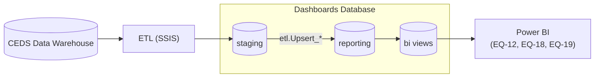

# Technical Overview

## Overview

This repository moves data from a CEDS Data Warehouse into a purpose-built dimensional DataMart (`Dashboards`), which
Power BI reads to answer selected E-W Framework Essential Questions. The database schema — not the ETL that
populates it — is the stable contract: any process capable of populating the `reporting`/`bi` schemas correctly can
replace the SSIS pipeline included here.

## Architecture

Power BI's only real dependency is the `bi` schema — everything upstream of it (`staging`, `reporting`, and the ETL
that populates them) can be replaced without changing a single report, as long as `bi` keeps producing the same
shape of data.

### Schema Layers

- **`staging`** — a landing zone shaped like the source extracts: K12 `Dim*`/`Fact*` tables and postsecondary
  `PS_Dim*` tables. Reloaded each ETL run; never queried directly by reports.
- **`etl`** — orchestration support only. `BatchControl` tracks which school year has been processed and when
  (`YearProcessed`, `LastRunDate`); the `Upsert_*` stored procedures merge `staging` rows into `reporting`.
- **`reporting`** — the conformed dimensional model: fact tables (K12 enrollments, course sections, assessments,
  staff counts, accessible-material assignments; postsecondary enrollments, course transcripts, academic awards) and
  their dimensions. This schema blends two kinds of dimensions: ones sourced from CEDS (schools, LEAs, SEAs,
  students, staff, courses) and reference dimensions that are seeded independently of any source system —
  disaggregates (race, disability, EL, foster care, homelessness, N-or-D status, economic disadvantage), grade
  levels, school years, and K12 demographics. The seed data lives in
  `Dashboards.Database/Scripts/SeedReportingDimensionTables` and runs via the post-deployment script on every
  publish.
- **`bi`** — the actual read contract for Power BI: `vw_*` views over `reporting`. This is where report-facing, tool-agnostic logic lives — for
  example, `vw_DimCohortYears` and `vw_DimCohortGraduationYears` derive cohort/graduation-year dimensions that don't
  exist as physical `reporting` tables. Point Power BI (or any other consumer) at `bi`, not `reporting` or `staging`.

### Data Flow

`Master.dtsx` orchestrates the load above one school year at a time, tracked in `etl.BatchControl`
(`YearProcessed`, `LastRunDate`) — each run processes a single year rather than the full history. K12 and
postsecondary data move through separate package pairs internally (`Load*.dtsx` vs. `PS_Load*.dtsx`) before landing
in the same `staging`/`reporting` tables. Power BI then queries `bi` views directly (Import or DirectQuery, depending
on the semantic model).

> As of this writing, the K12 staging-to-reporting steps are disabled in `Master.dtsx` — only the postsecondary (PS)
> path runs by default. Enable the corresponding executables in the package if you need K12 data populated through
> this pipeline.

### Semantic Models

Each Essential Question (`PowerBI/EQ-12`, `EQ-18`, `EQ-19`) is a fully self-contained `.pbip` — its own report *and*
its own semantic model, rather than several reports sharing one model. This keeps each EQ independently deployable
and embeddable (see the
[E-W Framework Analysis Tool](https://github.com/E-W-Framework-Analysis-Tool/E-W-Framework-Analysis-Tool), which
embeds these reports individually).

## Third-Party Dependencies

- SQL Server — hosts both the source CEDS Data Warehouse and the `Dashboards` DataMart
- SQL Server Integration Services (SSIS) — ETL orchestration
- Power BI Desktop / Service — visualization

## Hosting Considerations

Fully self-hosted by design: SQL Server, SSIS, and Power BI Desktop have no required cloud dependency. Publishing
reports to Power BI Service is optional and left to the consuming organization.

## Source Code and Auditing

Schema, ETL, and report definitions are all stored as plain text (`.sql`, DTSX/XML, PBIP/JSON), so every change is
reviewable via a normal git diff or pull request — no opaque `.bak` or `.pbix` binaries in source control.
